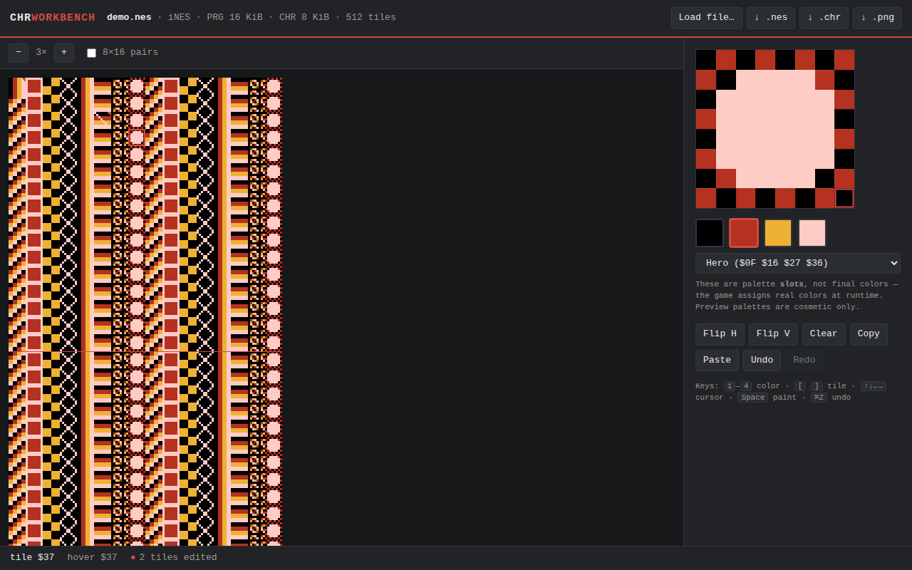

# CHR Workbench

A browser-based NES CHR tile editor. Load any `.nes` ROM or raw `.chr` dump,
see the full tile sheet decoded in grayscale, click tiles to edit them
pixel-by-pixel, and download a patched `.nes` with your edits spliced back
into the CHR section.

**Everything runs client-side — no file ever leaves your browser.**

**Live:** <https://djessemann.github.io/6502-hacker/>

## Screenshots



## Usage

1. Open the app and **drop a `.nes` or `.chr` file** anywhere on the page
   (or use _Load file…_). Files without an iNES header load as raw CHR data
   when their length is a multiple of 16 bytes.
2. The left pane shows every tile, 16 per row, with a red rule every 256
   tiles marking pattern-table boundaries. Zoom with **+ / −**, click a tile
   to select it.
3. Edit in the right pane: click-drag to paint, **1–4** pick a palette slot,
   arrow keys move a cursor and **Space** paints at it. **[** and **]** step
   through tiles. Tools cover flip H/V, clear, copy/paste, and undo/redo
   (**Cmd/Ctrl+Z**, ~200 steps).
4. Edited tiles get a small red corner mark; the status bar tracks the count.
5. Export with the header buttons: a **patched `.nes`** (original bytes with
   only the CHR section replaced), a **raw `.chr`**, or a **PNG** of the
   sheet — saved as `{original}-edited.{ext}`.

Games with CHR size 0 use **CHR-RAM** — their graphics are generated by
program code at runtime, so there is no CHR section to edit and the app
says so instead of guessing.

## The 2bpp planar format

NES graphics are stored as 8×8 tiles, 16 bytes each, at 2 bits per pixel —
but the two bits of a pixel are **not** adjacent. Bytes 0–7 are bitplane 0
(the low bit of each pixel, one byte per row) and bytes 8–15 are bitplane 1
(the high bit). Pixel _(x, y)_ of tile _t_ is:

```
bit   = 7 − x
color = ((chr[t·16 + y] >> bit) & 1) | (((chr[t·16 + 8 + y] >> bit) & 1) << 1)
```

The four values 0–3 aren't colors, just **palette slots**: the game maps
them to real colors from the NES master palette at runtime. That's why the
editor defaults to grayscale and treats its NES-color presets as cosmetic
previews only.

### Why the 8×16 pair view?

Many games run the PPU in 8×16 sprite mode, where each sprite is two
vertically stacked tiles: the even tile on top, the odd tile below.
Characters drawn for this mode look interleaved and scrambled in a plain
sheet. The pair view reorders the sheet so pairs stack the way the hardware
composes them, and the editor edits both tiles as one 8×16 unit — flips
included (flip V swaps the tiles _and_ flips each, so the unit flips as a
whole).

## Development

No runtime dependencies — Vite + TypeScript with vanilla DOM and canvas.

```sh
npm install
npm run dev      # local dev server
npm test         # vitest (chr codec + iNES parser)
npm run lint     # eslint + prettier
npm run build    # type-check + production build
```

Pure logic lives in `src/chr.ts` (2bpp codec) and `src/ines.ts` (ROM
parsing/patching); both are fully unit-tested against hand-computed
fixtures. `src/sheet.ts` and `src/editor.ts` render the two canvases,
`src/state.ts` holds all state in memory (nothing is ever persisted), and
`src/main.ts` wires the UI.

On push to `main`, GitHub Actions runs lint + tests, builds, and deploys to
GitHub Pages.

`.gitignore` excludes `*.nes` and `*.chr` so nobody accidentally commits ROM
data — bring your own homebrew or public-domain files.

## License

[MIT](LICENSE)
